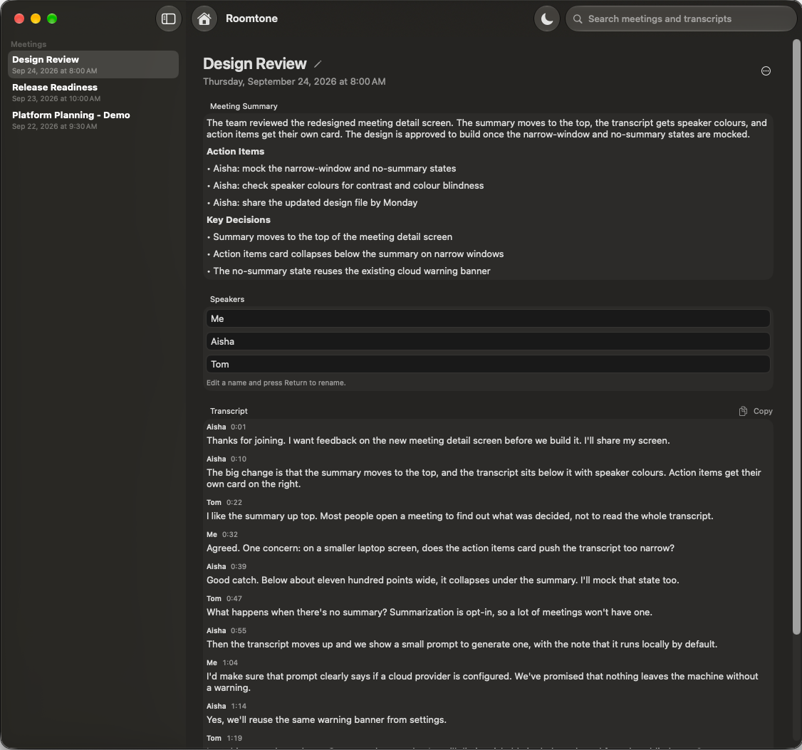
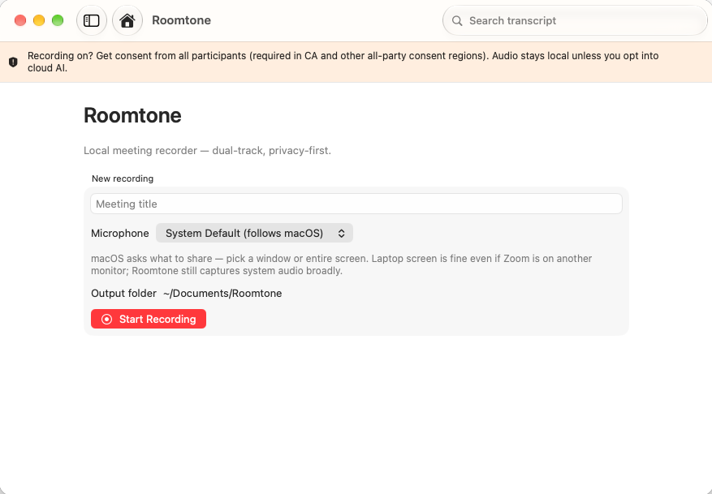

# Roomtone

**Local-first meeting recorder for macOS.**

Records your mic and the meeting audio (Zoom, Slack, Meet, whatever) as separate
tracks, transcribes offline, labels speakers, and exports transcripts. Summaries
are optional and can use a local model or a cloud one.



[](./LICENSE)

> **Source available — free for personal use.**  
> Not an OSI “Open Source” license. Commercial / white-label use needs a [deal](./COMMERCIAL.md).

## Principles

- Local-first: audio and transcripts stay on your Mac
- Privacy-first: nothing is uploaded unless you turn on a cloud summary provider
- No required subscription
- Clean, replaceable architecture (see [AGENTS.md](./AGENTS.md))

## Status

Alpha. I use it for my own meetings every day, but expect rough edges. There is
no signed download yet, so you build it from source.

## Requirements

- macOS 14+ (Apple Silicon recommended)
- Xcode 16+
- Python 3.9+ (the one that comes with Xcode's command line tools is fine)
- [XcodeGen](https://github.com/yonaskolb/XcodeGen): `brew install xcodegen`
- About 1 GB of disk for the Python environment and speech model

## Build and run

```bash
git clone https://github.com/ibain/roomtone.git
cd roomtone
bash Scripts/asr/setup.sh   # creates Scripts/asr/.venv
```

**Set your own signing** before generating the project. Copy the example file
and put your Apple team ID and a bundle ID you own (like `com.yourname.roomtone`)
in it. A free Apple ID works. The copy is gitignored. Use this file rather than
Xcode's signing settings, because `xcodegen generate` overwrites the Xcode project.

```bash
cp Config/Signing.local.xcconfig.example Config/Signing.local.xcconfig
xcodegen generate
open Roomtone.xcodeproj
```

Build and run the **Roomtone** scheme. The app finds `Scripts/asr/` in the
checkout it was built from, so keep the clone where it is.

## Recording

Roomtone records your microphone and meeting audio as separate tracks while keeping recordings local.



1. Click record. macOS asks for **Microphone** access, then shows its share
   picker. Pick the meeting app's window (or the whole screen). Roomtone only
   records audio from it, never video.
2. If you denied a prompt, turn it on in System Settings → Privacy & Security →
   Microphone / Screen & System Audio Recording, then quit and relaunch Roomtone.
3. Stop the recording. The first transcription downloads the Whisper model
   (`small.en`, about 500 MB), so it needs internet once. After that,
   transcription works offline.
4. Remote speakers come out as Speaker 2, Speaker 3, and so on. Rename them in
   the meeting view; transcripts and exports update.

**Get consent before recording.** California and other all-party consent places
require everyone on the call to agree.

## Where things live

| What | Where |
|---|---|
| Meetings (audio, transcripts, summaries) | `~/Documents/Roomtone/<date> <title>/` (changeable in Settings) |
| Settings | `~/Library/Application Support/Roomtone/settings.json` |
| Log | `~/Library/Logs/Roomtone/roomtone.log` |
| Speech models | `~/.cache/huggingface/hub/` |

Your API key, if you add one, is stored in plain text in `settings.json`.
Keychain storage is on the list.

## Summaries (optional)

Off by default. In Settings → AI, pick:

- **Local OpenAI-compatible:** anything that serves `/v1/chat/completions` on
  your Mac, like [Ollama](https://ollama.com) (`http://127.0.0.1:11434/v1`) or
  LM Studio.
- **OpenAI API:** needs an API key. Your transcript text is sent to OpenAI.

Settings shows a warning whenever the provider's address is not on this Mac,
including a "local" provider pointed at a remote server.

## Better speaker handoffs (optional)

In meetings where one person hands the floor to the next ("Sam, you're next"),
the name-call can end up attached to the wrong speaker. Roomtone can fix that
if it knows the names. Create `names.txt` in your meetings folder
(`~/Documents/Roomtone/` by default) with one name per line, in lowercase. Add the misspellings Whisper uses too:

```
sam
priya
pria
```

Without the file, those fixes are skipped and everything else works the same.

## Known limitations

- Two remote people with similar voices can be merged into one speaker.
- Very short replies ("Oh", "Uh-huh") are sometimes given to the wrong speaker.
- English models by default. Other languages work, but I've tested them less.
- "Delete recordings after transcription" removes the WAV files, so you can't
  **Reprocess** that meeting afterwards.

More detail in [docs/diarization.md](./docs/diarization.md).

## Troubleshooting

- **"Transcription environment missing":** run `bash Scripts/asr/setup.sh`.
  Roomtone never falls back to your system Python.
- **Mic is dead in every app, not just Roomtone:** macOS audio is stuck. Run
  `sudo killall coreaudiod`.
- **Recording won't start:** check the log. It records both audio devices and
  their sample rates before starting.

## Uninstall

Delete the app, then remove `~/Library/Application Support/Roomtone`,
`~/Library/Logs/Roomtone`, and `Scripts/asr/.venv`. Your meetings in
`~/Documents/Roomtone` are left alone.

## How it works

1. Dual-track capture (ScreenCaptureKit + AVAudioEngine mic) → WAV at 48 kHz
2. Offline transcription with faster-whisper (see `docs/asr-bakeoff.md`)
3. Speaker labels: mic track = you, voice clustering on the meeting track
4. Optional summary through a pluggable provider
5. Export to Markdown, TXT, JSON, SRT, or VTT

## License

[PolyForm Noncommercial 1.0.0](./LICENSE): personal / noncommercial use.  
Commercial licensing: [COMMERCIAL.md](./COMMERCIAL.md).

## Contributing

See [CONTRIBUTING.md](./CONTRIBUTING.md) (DCO required).
